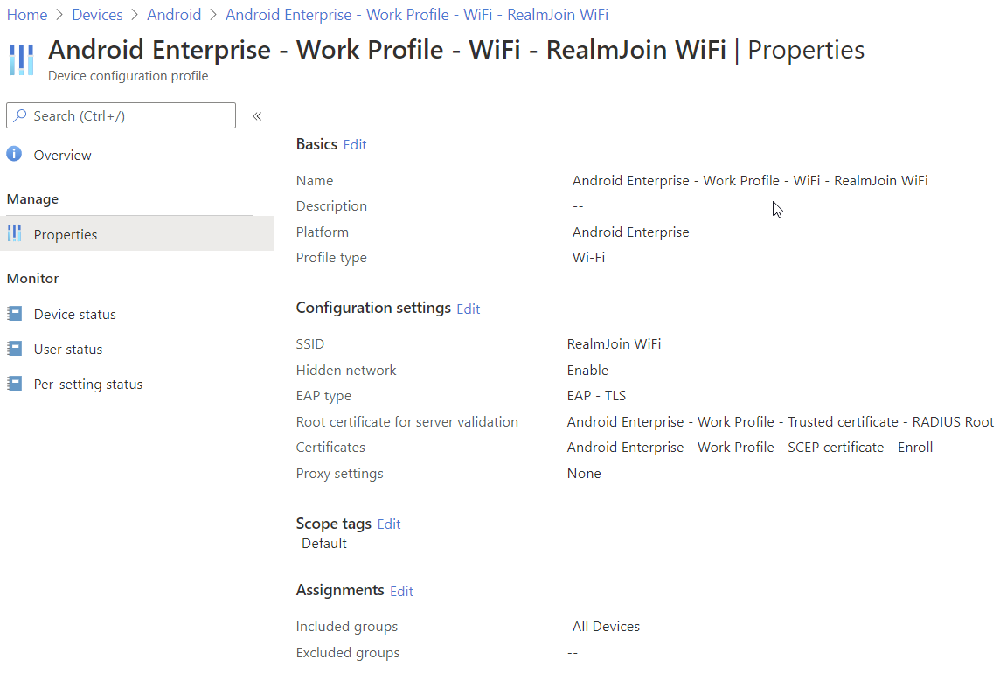

# Android

Before creating the **Wi-Fi** profile, create a **Trusted root certificate** profile as described [**here**](https://glueckkanja.gitbook.io/radius-as-a-service/how-to-use/intune-wifi-deployment/windows#server-certificate). Change your **Platform** accordingly and use the following certificate because Android requires a special format:



The following list and screenshot show you all necessary configurations:

1. Log in to your [Azure portal](https://porta.azure.com)
2. Navigate to **Microsoft Intune\(Endpoint Manager\)** -&gt; **Devices** -&gt; **Android** -&gt; **Configuration profiles**
3. Then click **Create Profile**
4. As **Platform** select **Android Enterprise**
5. As **Profile type** select **Wi-Fi**
6. Then as **Wi-Fi type** choose **Enterprise**
7. As **EAP type** choose **EAP - TLS**
8. Next as **Root certificate for server validation** select your created **Trusted Root** profile
9. Finally select your certificate profile under **Client Authentication**

