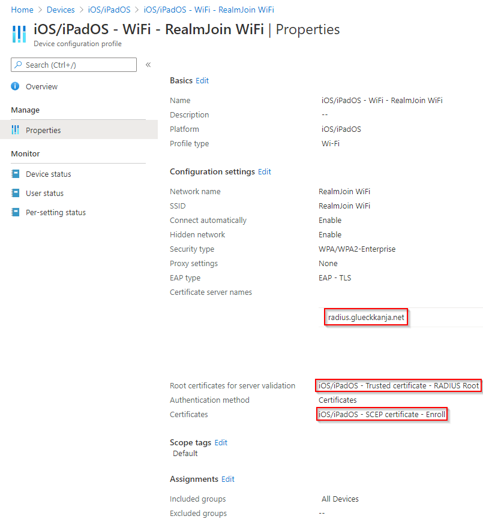

# Apple Devices

The following list and screenshot show you all necessary configurations:

Before creating the **Wi-Fi** profile, create a **Trusted root certificate** profile as described [**here**](https://glueckkanja.gitbook.io/radius-as-a-service/how-to-use/intune-wifi-deployment/windows#server-certificate). Change your **Platform** accordingly.

1. Log in to your [Azure portal](https://porta.azure.com)
2. Navigate to **Microsoft Intune\(Endpoint Manager\)** -&gt; **Devices** -&gt; **iOS/iPadOS\(macOS\)** -&gt; **Configuration profiles**
3. Then click **Create Profile**
4. As **Platform** select **iOS/iPadOS\(macOS\)**
5. As **Profile type** select **Wi-Fi**
6. Then as **Wi-Fi type** choose **Enterprise**
7. As **EAP type** choose **EAP - TLS**
8. Next, as **Certificate server names** add **radius.glueckkanja.net**
9. Select the created **Trusted root certificate** profile
10. Finally under **Client Authentication** select your certificate profile

