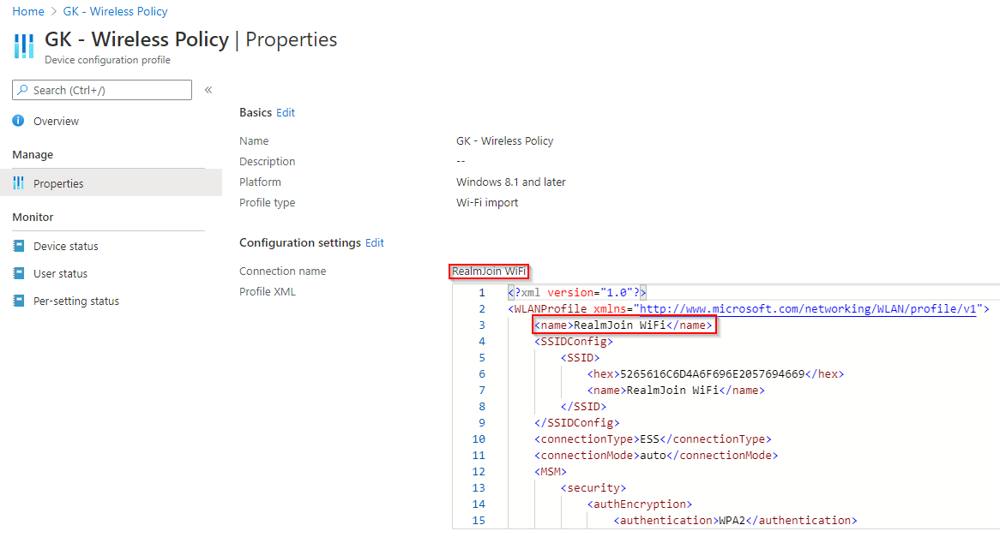

# Windows

## Certificate Type

For Windows Devices there are two options to create the WiFi Policy and it depends on User or Device certificates which you are deploying which needs to be used.

If User certificates where deployed, follow the steps under [User Certificates](./#user-certificates). With [Device Certificates](./#device-certificates), use the WiFi XML which you get from our support team or look [here ](wifi-xml.md)to edit on your own.

### Device Certificates 

The following list and screenshot show you all necessary configurations:

1. Log in to your [Azure portal](https://porta.azure.com)
2. Navigate to **Microsoft Intune\(Endpoint Manager\)** -&gt; **Devices** -&gt; **Windows**  -&gt; **Configuration profiles**
3. Then click **Create Profile**
4. As **Platform** select **Windows 8.1 and later**
5. As **Profile type** select **Wi-Fi import**
6. Finally enter a **Connection name** and upload the Wi-Fi XML which matches the value of the first **&lt;name&gt;** tag of your XML

### User Certificates

Our Server has a certificate which the clients needs to trust. The XML contains all that data. For user certificates it's needed to create certificate profiles which can be added in the Wi-Fi profile afterwards. Otherwise your clients will see the following question.

The following lists and screenshot show you all necessary configurations:

#### Server Certificate

1. Log in to your [Azure portal](https://porta.azure.com)
2. Navigate to **Microsoft Intune** and click **Device configuration**
3. Then click **Create Profile**
4. As **Platform** select **Windows 8.1 and later**
5. As **Profile type** select **Trusted certificate**
6. Upload the following certificate.



#### Wi-Fi Profile

1. Navigate to **Microsoft Intune\(Endpoint Manager\)** -&gt; **Devices** -&gt; **Windows**  -&gt; **Configuration profiles**
2. Then click **Create Profile**
3. As **Platform** select **Windows 10 and later**
4. As **Profile type** select **Wi-Fi**
5. As **Wi-Fi type** select **Enterprise** 
6. Then for **EAP type** choose **EAP - TLS**
7. Next as **Certificate server names** add **radius.glueckkanja.net**
8. Select the created RADIUS certificates in **Root certificates for server validation**
9. Finally as **Client Authentication** select your SCEPman user certificate profile


All other settings can be configured according to your own needs and preferences.


