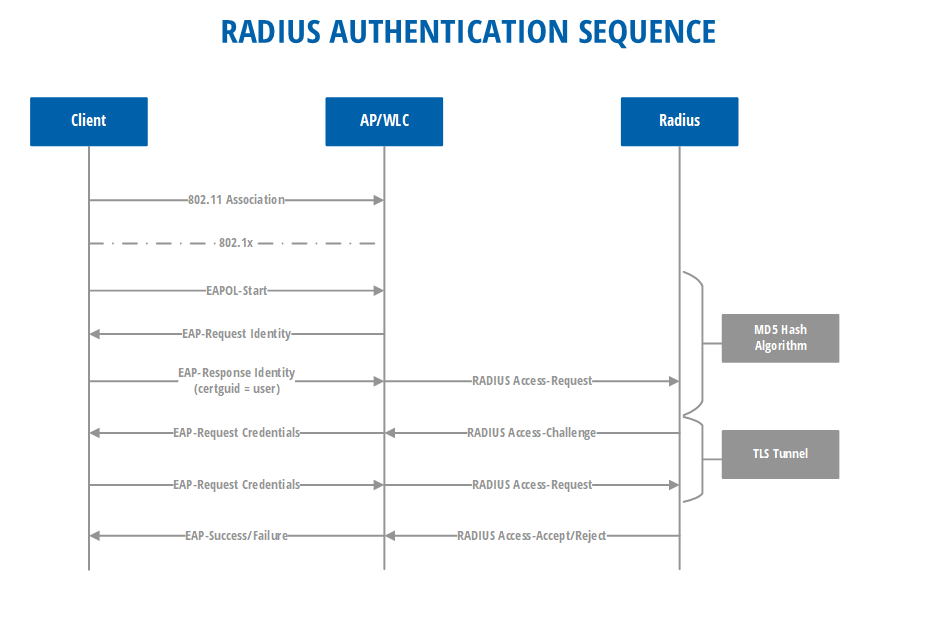
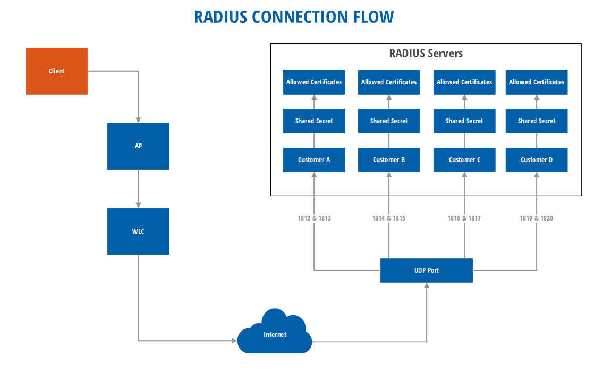

# Introduction

The following documentation will show you how to [onboard and use](access-point-setup/) the RADIUS-as-a-Service \(RADIUSaaS\) managed service to provide cloud based RADIUS authentication with zero on-premises requirements.

## What is RADIUS

Whenever large companies need network authentication, [RADIUS ](https://tools.ietf.org/html/rfc2865)is the protocol of choice. RADIUS is a AAA protocol which means **authentication, authorization and accounting** and therefore best suited for logging into the Wi-Fi. The protocol was developed by Livingston Enterprises, Inc. in 1991 and is now one of the IETF standards.

## What is RADIUS-as-a-Service

If you want to host your own RADIUS system you need machines, engineers and depending of your setup a complete Active Directory that your system can match the user which wants to authenticate. You do not need to care about authentication of access points in Wi-Fi or in VPN environments because RADIUSaaS is working as a SaaS-Offering and you only need to add the RADIUSaaS IP-addresses to your ecosystem.

### Which certificates can be used?

The easiest solution to authenticate your clients is [SCEPman](https://glueckkanja.gitbook.io/scepman/index) which has the benefit to disallow the access of your clients by disabling the device in Azure. You only have to provide us with your instance URL to setup your RADIUS-as-a-Service instances.   
  
But if you want to use your own on-premise PKI or need a migration phase for both worlds, you can also tell us any other Root-CA to verify your clients.

### OCSP

To work with revocation of certificates our RADIUS system can also work with OSCP. A certificate revocation list is currently not supported. 

### Authentication Flow 

The following two illustrations show the authentication flow of RADIUS. The first illustration shows the **RADIUS authentication sequence** and the second illustration shows the **RADIUS connection flow**.

 

